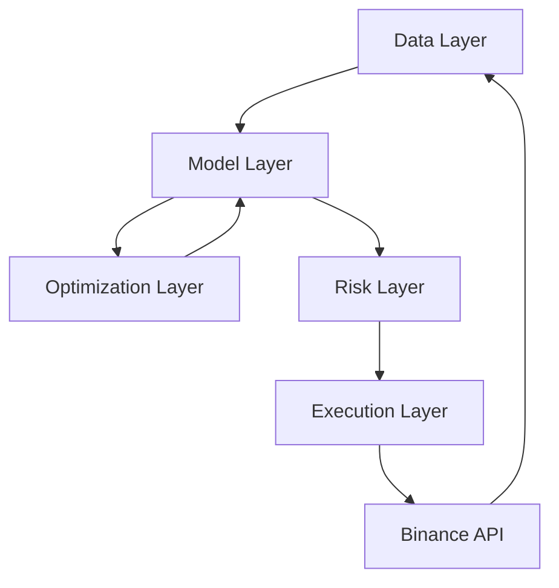

# Technical Architecture

This document outlines the modular design of the Gradient-Based Trading System.

## High-Level Architecture

The system is designed with strict separation of concerns, allowing for rapid iteration on the mathematical model without disrupting the execution or data infrastructure.

## Layers

### 1. Data Layer (ETL & State Construction)
Responsible for ingesting, cleaning, and transforming raw market data into the mathematical state representation $X(t)$.

*   **Inputs**: Price candles (OHLCV), Order Book snapshots, Funding Rates.
*   **Outputs**: State Tensor $X_t \in \mathbb{R}^N$ (Normalized, Denoised).
*   **Components**:
    *   `ExchangeConnector` (CCXT based): Async fetching from Binance.
    *   `StateTransformer`: Computes features (e.g., Log Returns, Kalman Filtered Price, Order Flow Imbalance).
    *   `DataLoader`: PyTorch `DataLoader` for batching historical data during training.

### 2. Model Layer (Dynamical System)
Encapsulates the mathematical model of the market dynamics. This is the core "physics engine" of the price.

*   **Inputs**: Current State $X_t$, Time $t$.
*   **Outputs**: Predicted Next State $\hat{X}_{t+1}$, Confidence/Variance $\sigma^2_t$.
*   **Core Abstraction**: `DynamicalSystem(nn.Module)`
    *   Method: `forward(state, time_horizon)` -> `trajectory`
    *   Equation: $dX/dt = f(X, t, \theta)$
    *   Implementation: Neural ODE (torchdiffeq) or custom RNN/LSTM with physical constraints.

### 3. Optimization Layer (Gradient Computation)
The "Brain" that adjusts parameters $\theta$ to minimize the cost functional $J(\theta)$.

*   **Inputs**: Model predictions, Real market data, Risk constraints.
*   **Outputs**: Optimized Parameters $\theta^*$, Trading Signals (Position Size $u_t$).
*   **Mechanism**:
    *   Define Loss Function $L = \text{MSE} + \lambda \cdot \text{Risk}$.
    *   Backpropagate gradients: $\nabla_\theta L$.
    *   Update $\theta$ using Adam/SGD.

### 4. Risk Layer (Constraints & Sizing)
Acts as a filter and safety mechanism. It translates raw model outputs into safe actionable orders.

*   **Inputs**: Raw Signal $u_{raw}$, Account Equity, Volatility Estimate.
*   **Outputs**: Final Position Size $u_{safe}$, Stop Loss / Take Profit levels.
*   **Logic**:
    *   Kelly Criterion (fractional).
    *   Volatility Targeting (inverse volatility sizing).
    *   Hard Drawdown Limits (circuit breakers).

### 5. Execution Layer (Order Management)
Handles the interaction with the exchange.

*   **Inputs**: Target Position $u_{safe}$.
*   **Outputs**: Limit/Market Orders.
*   **Components**:
    *   `OrderManager`: Tracks open orders and fills.
    *   `PortfolioTracker`: Real-time PnL and exposure monitoring.
    *   `PaperTrader`: Simulates execution for testing.

## Deployment Strategy

*   **Local Development**: Docker Compose with Jupyter Lab for research.
*   **Production**:
    *   Headless Python service in Docker container.
    *   Redis for state persistence (optional).
    *   Prometheus/Grafana for monitoring system health and PnL.
